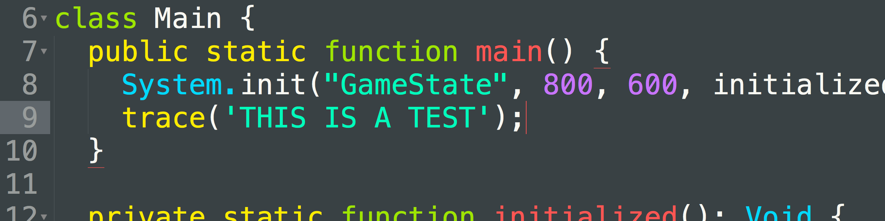
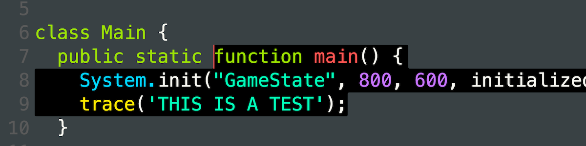
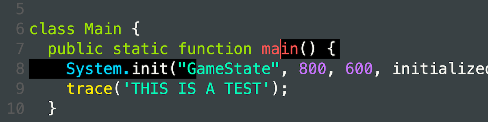
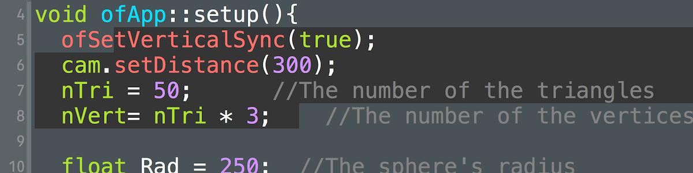

# lestle theme collection
lovely simple and clear theme for - sublime/atom/vscode/xcode

rather than the 'too dark' or even 'too bright' of most color schemes. i have been always after something which can suit both parties.
so rather than switching themes, its easy to stick with one

not too dark, not too bright... just right ;)

enjoy

lewis lepton

***INSTALL SUBLIME***
---
easy to install. simply place the `lestle_sublime` folder in your sublime packages folder - which is located [on mac]
`HD/Users/userName/Library/Aplication Support/Sublime Text 3/Packages/User`


***INSTALL VSCODE***
---
easy to install. simply place the `lestle_vscode` folder in your vscode extensions folder - which is located [on mac]
`HD/Users/userName/.vscode/extensions`
please use the 'show & hide' below


there is a newer 2017 version, which will fix problems for vscode now. this is for versions of vscode >= 1.12. installation is the same

***INSTALL ATOM***
---
easy to install. simply place the `lestle_atom` folder in your vscode extensions folder - which is located [on mac]
`HD/Users/userName/.atom/packages`
please use the 'show & hide' below


***INSTALL XCODE***
---
easy to install. simply place the `.dvtcolortheme` in to your themes folder at
`HD/Users/userName/Library/Developer/Xcode/UserData/FontAndColorThemes`


***SHOW & HIDE***
---
you will have to 'show' hidden files on mac computers to get to the folder. so you can use this to show
```defaults write com.apple.finder AppleShowAllFiles -boolean true ; killall Finder```

then use this to hide again
```defaults write com.apple.finder AppleShowAllFiles -boolean false ; killall Finder```