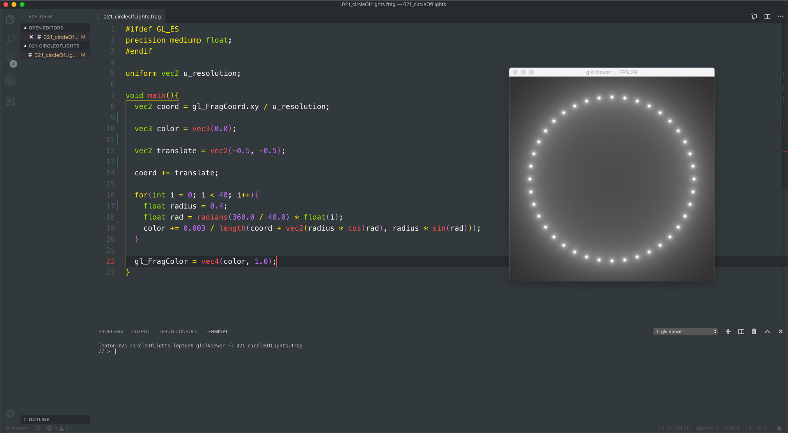

# Lestle

***LESTLE*** is a simple & minimal theme for the eyes.

Rather than go for something too dark, or too bright, we have something in the middle. It's just feels right ;)

# Features
• Easy on the eyes colors.  
• Sidebar/Gutter colors 
  Green - ***Added***  
  Purple - ***Modified***  
  Red - ***Deleted***  
  Grey - ***Highlighted named item*** 
• Smooth line number viewing 
• Light line viewing markers 
• Looks lovely

I plan to have additions to this theme & fix colors when needed/found that I may have missed. Things would change from time to time. But nothing drastic ;)

Enjoy, have phün & happy coding

[Lewis Lepton](https://lewislepton.com)

Any problems, by all means go & make an issue

*The themes for XCode, Sublime & Atom are still available - but are now stored in the `oldbranch` branch. I dont plan to update these any time soon*

# Change Log
- *1.0.0* - updated original to be more bad ass